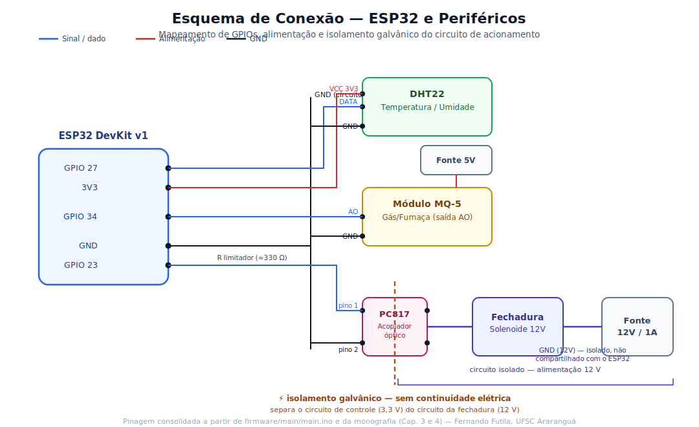
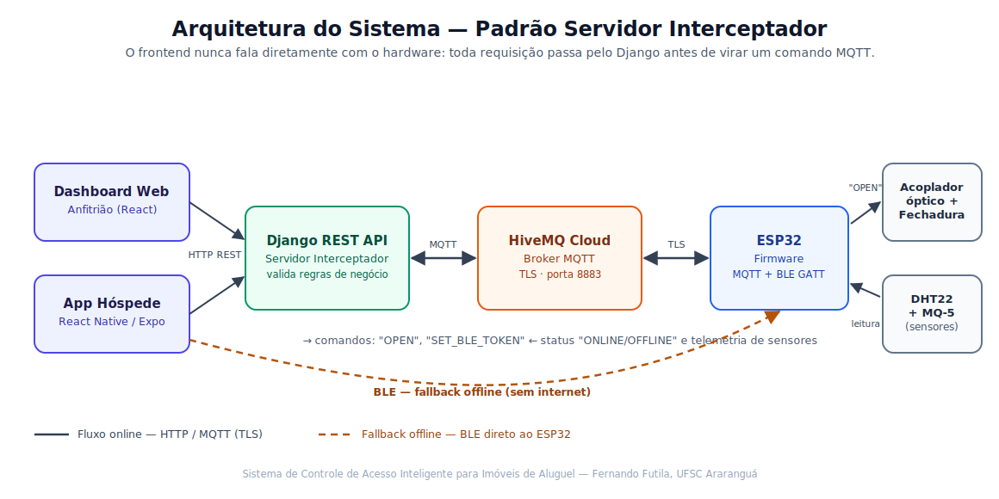
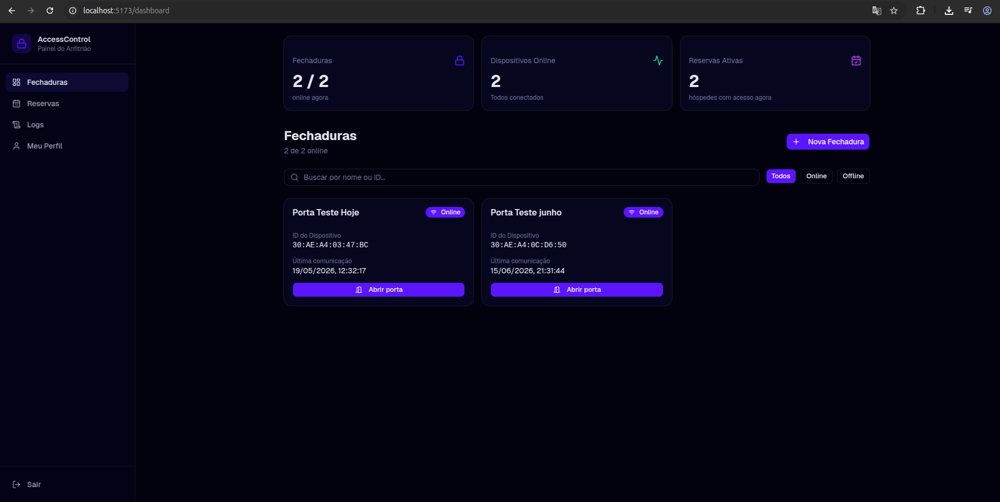
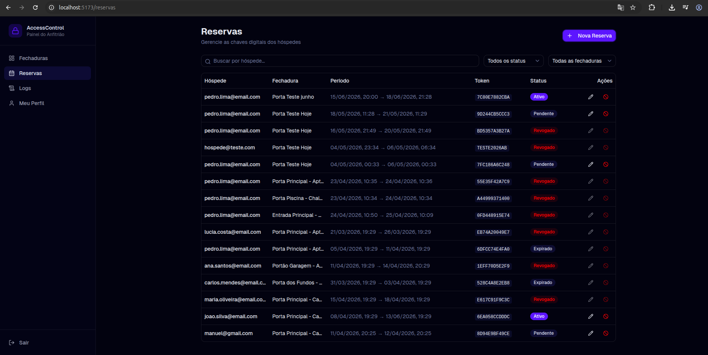
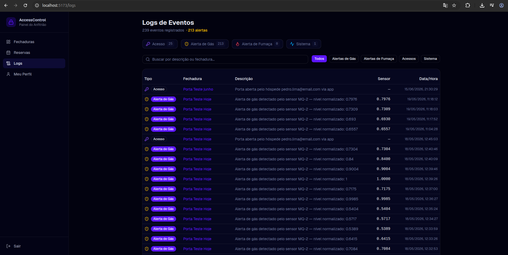
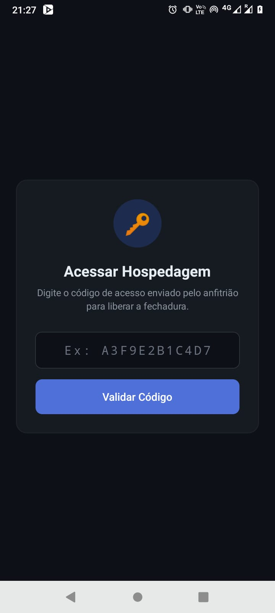
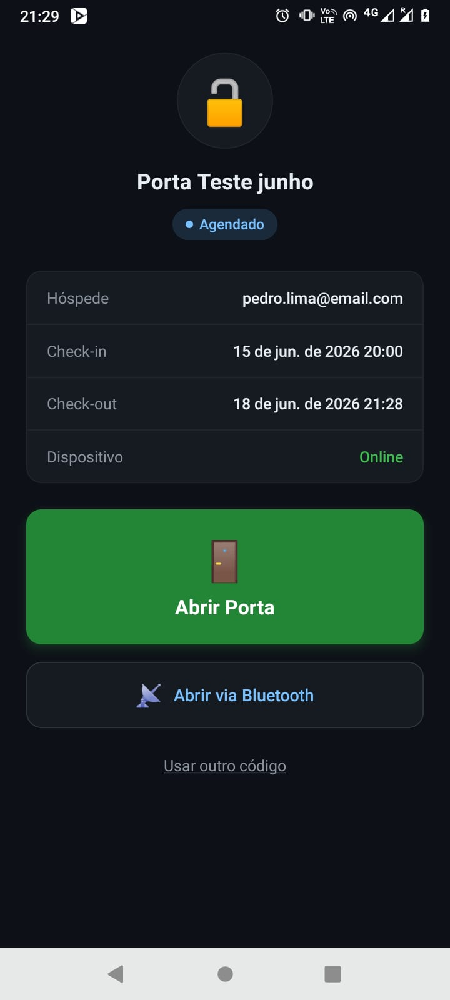
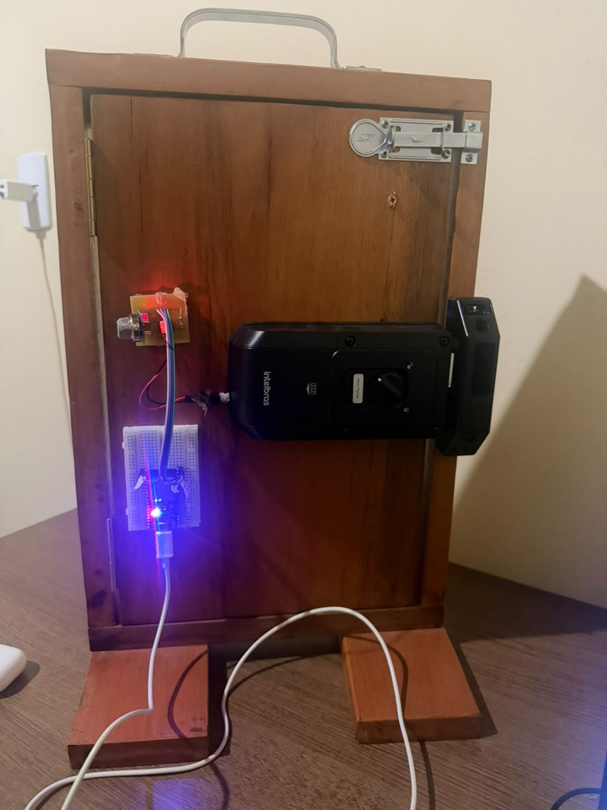

# Uma Proposta de Controle de Acesso Inteligente para Imóveis de Aluguel (IoT)

Sistema IoT para controle de acesso em imóveis de curta temporada (estilo Airbnb): chaves digitais temporárias vinculadas a reservas, monitoramento de sensores ambientais (gás e temperatura/umidade) e fallback de abertura offline via Bluetooth (BLE) quando não há internet no local.

O projeto resolve um problema concreto do aluguel por temporada: fechaduras inteligentes comerciais são pensadas para uso residencial fixo — não geram credenciais temporárias automaticamente, exigem configuração presencial a cada novo hóspede e raramente integram sensores de segurança. Aqui, o anfitrião cadastra a reserva, o hóspede recebe um token válido apenas durante o período contratado, e a fechadura se comunica com o sistema por dois canais complementares (internet/MQTT e Bluetooth offline).

## Autores e Papéis

| Nome                            | Papel                                                                                  |
| ------------------------------- | -------------------------------------------------------------------------------------- |
| **Fernando Doqui Futila**       | Autor — projeto, desenvolvimento full-stack (backend, dashboard, app mobile, firmware) |
| **Fábio Rodrigues De La Rocha** | Orientador do TCC — UFSC Araranguá                                                     |

---

## Introdução

A economia compartilhada, consolidada por plataformas como Airbnb e Booking.com, transformou imóveis residenciais comuns em ativos de hospedagem de curta duração — mas a infraestrutura de controle de acesso não acompanhou essa mudança. Chaves físicas ainda são a norma em muitos imóveis: geram custo logístico de deslocamento para entrega, risco de cópia não autorizada e nenhuma auditoria sobre quem entrou e quando.

A Internet das Coisas (IoT) resolve essa lacuna ao digitalizar a barreira física, mas a maioria das fechaduras inteligentes comerciais continua voltada para o uso residencial fixo: não geram credenciais temporárias automaticamente, exigem interação presencial para configurar cada novo usuário e raramente monitoram condições ambientais que colocam o imóvel em risco (vazamento de gás, por exemplo) enquanto o proprietário está ausente.

Este projeto propõe uma arquitetura de **Servidor Interceptador**: toda a lógica de autorização fica concentrada no backend (Django), que valida se a reserva está ativa antes de permitir qualquer comando à fechadura — o frontend (dashboard ou app) nunca fala diretamente com o hardware. Quando a internet falha no local, um canal alternativo via Bluetooth permite a abertura mesmo offline, com o token de acesso pré-carregado no dispositivo enquanto a conexão ainda estava disponível.

---

## Hardware Necessário

| Componente                       | Especificação                                                                   | Custo aprox.  |
| -------------------------------- | ------------------------------------------------------------------------------- | ------------- |
| ESP32 DevKit v1                  | Microcontrolador dual-core com Wi-Fi e BLE integrados, ADC 12 bits              | R$ 45,00      |
| Módulo sensor MQ-5               | Sensor de gás combustível (GLP, gás natural), módulo com comparador onboard     | R$ 18,00      |
| Sensor DHT22                     | Temperatura e umidade relativa — resolução 0,1 °C, precisão ±0,5 °C             | R$ 18,00      |
| Acoplador óptico PC817           | Isolamento galvânico entre o circuito de controle (3,3V) e o da fechadura (12V) | R$ 3,00       |
| Fechadura elétrica solenoide 12V | Trava da porta, acionada pelo acoplador óptico                                  | R$ 55,00      |
| Fonte de alimentação 12V / 1A    | Alimenta a fechadura solenoide                                                  | R$ 25,00      |
| Jumpers, resistores e protoboard | Montagem e prototipagem                                                         | R$ 10,00      |
| **Total**                        |                                                                                 | **R$ 174,00** |

Custos aproximados praticados no mercado nacional (2025) — o objetivo é manter o custo de replicação do protótipo abaixo de R$ 200,00, usando hardware open-source amplamente disponível.

---

## Esquema de Conexão



| GPIO (ESP32) | Componente                                         | Observação                                                  |
| ------------ | -------------------------------------------------- | ----------------------------------------------------------- |
| GPIO 23      | Acoplador óptico PC817 → fechadura solenoide (12V) | Nível alto por 3s aciona a fechadura; mantido baixo no boot |
| GPIO 34      | Sensor MQ-5 (saída AO)                             | Somente entrada — não conectar saídas neste pino            |
| GPIO 27      | Sensor DHT22 (dados)                               | Leitura a cada 10s                                          |
| GPIO 2       | LED interno                                        | Indicador de status da conexão MQTT                         |

**Por que um acoplador óptico?** O ESP32 opera em lógica de 3,3V; a fechadura solenoide precisa de 12V. O acoplador óptico transmite o sinal de acionamento por luz (um LED interno ilumina um fototransistor), sem qualquer conexão elétrica direta entre os dois circuitos. Isso protege o microcontrolador contra picos de tensão ou curtos que possam ocorrer no lado de 12V — o circuito de alimentação da fechadura tem seu próprio referencial de terra (GND), independente do GND do ESP32.

Processo de montagem: definição do pinout a partir dos requisitos funcionais → dimensionamento do circuito de acionamento (escolha do acoplador óptico para isolamento) → montagem em protoboard para prototipagem rápida → validação incremental de cada subsistema (fechadura, MQ-5, DHT22) via monitor serial, antes da integração com o protocolo MQTT.

---

## Instalação

### Pré-requisitos gerais

- **Python** ≥ 3.10
- **Node.js** ≥ 18 + NPM
- **Arduino IDE** ≥ 2.x (com suporte ao ESP32)
- **EAS CLI** (`npm install -g eas-cli`) — para build do app mobile
- Conta no **HiveMQ Cloud** (gratuita) com um cluster criado

### Hardware

1. Monte o circuito conforme o [Esquema de Conexão](#esquema-de-conexão) acima (protoboard recomendada para os primeiros testes).
2. Valide cada subsistema individualmente pelo monitor serial do Arduino IDE antes de integrar tudo: primeiro o acionamento do acoplador óptico/fechadura, depois a leitura do MQ-5, depois o DHT22.
3. Detalhes completos de pinagem, bibliotecas e configuração ficam em [`firmware/README.md`](firmware/README.md).

### Software

Cada camada tem um README próprio com o passo a passo completo. Resumo mínimo para rodar tudo localmente:

| Camada                | Comando mínimo                                                                                                                                               | Detalhes                                         |
| --------------------- | ------------------------------------------------------------------------------------------------------------------------------------------------------------ | ------------------------------------------------ |
| Backend (Django)      | `cd backend && python -m venv venv && source venv/bin/activate && pip install -r requirements.txt && python manage.py migrate && python manage.py runserver` | [`backend/README.md`](backend/README.md)         |
| Dashboard Web (React) | `cd dashboard && npm install && npm run dev`                                                                                                                 | [`dashboard/README.md`](dashboard/README.md)     |
| App Hóspede (Expo)    | `cd hospede-app && npm install && npm start`                                                                                                                 | [`hospede-app/README.md`](hospede-app/README.md) |
| Firmware (ESP32)      | Copiar `firmware/main/secrets.h.example` → `secrets.h`, preencher credenciais, gravar via Arduino IDE                                                        | [`firmware/README.md`](firmware/README.md)       |

> As credenciais de Wi-Fi e do broker MQTT ficam em `firmware/main/secrets.h` (não versionado) — nunca em `main.ino`.

---

## Projeto Final



### Funcionalidades

- ✅ **Tokens temporários** — o anfitrião define o período de validade vinculado à reserva
- ✅ **Abertura remota** — o hóspede abre a porta pelo app ou o anfitrião pelo dashboard
- ✅ **Fallback BLE offline** — o app abre a fechadura via Bluetooth mesmo sem internet
- ✅ **Monitoramento de sensores** — temperatura/umidade (DHT22) e gás (MQ-5) em tempo real
- ✅ **Segurança autônoma** — em alerta de gás, o relé abre imediatamente, sem esperar comando do servidor
- ✅ **Logs de acesso** — histórico completo de eventos e telemetria

### Telas do projeto

| Dashboard do anfitrião                                 | Reservas                                           | Log de eventos                                    |
| ------------------------------------------------------ | -------------------------------------------------- | ------------------------------------------------- |
|  |  |  |

| App do hóspede — token                              | App do hóspede — acesso                               | Protótipo físico                                                       |
| --------------------------------------------------- | ----------------------------------------------------- | ---------------------------------------------------------------------- |
|  |  |  |

Referência completa dos endpoints REST e do contrato MQTT: [`docs/api.md`](docs/api.md).

---

## Tutorial

### Testando sensores e comunicação MQTT

Antes de integrar tudo no firmware final, o protocolo MQTT foi validado isoladamente em [`firmware/MQTT/`](firmware/MQTT/) — um conjunto de exemplos didáticos, independentes do broker HiveMQ do projeto (usam o broker público `broker.emqx.io`):

- `firmware/MQTT/app1.js` / `app2.js` — scripts Node.js que publicam e assinam tópicos MQTT de teste (temperatura, LEDs), úteis para entender publish/subscribe antes de mexer no ESP32.
- `firmware/MQTT/arduino/mqtt/mqtt.ino` — sketch de teste que liga/desliga LEDs no ESP32 a partir de mensagens MQTT (ajuste as credenciais de Wi-Fi no topo do arquivo antes de gravar).
- `firmware/MQTT/servidor/` — servidor Express com uma página web de demonstração do MQTT no navegador (`npm install && node index.js`, depois abra `localhost:4000`).
- Introdução ao protocolo (conceitos, portas, broker) em [`firmware/MQTT.md`](firmware/MQTT.md).

### Problemas encontrados e soluções

| Problema                                                                   | Solução                                                                                   |
| -------------------------------------------------------------------------- | ----------------------------------------------------------------------------------------- |
| Erro de compilação por função usada antes de declarada                     | Forward declaration de `abrirFechadura()`                                                 |
| "Sketch too large" ao gravar o firmware                                    | Partition Scheme "Huge APP (3MB No OTA/1MB SPIFFS)"                                       |
| Handshake MQTT-TLS falhava com BLE ativo                                   | BLE e MQTT tornados mutuamente exclusivos (heap insuficiente para os dois ao mesmo tempo) |
| Loop de reconexão ONLINE/OFFLINE                                           | BLE desativado explicitamente ao reconectar o MQTT                                        |
| Pinos de simulação (LED) confundidos com os pinos reais                    | Constantes de pino corrigidas para o hardware físico definitivo                           |
| Divergência entre MQ-5 digital (monografia) e leitura analógica (firmware) | Documentada — funciona via saída AO, alinhamento total fica como melhoria futura          |
| "Erro ao criar fechadura" na API + falha de segurança                      | `perform_create` e `get_queryset` por proprietário no `FechaduraViewSet`                  |
| EAS Build falhando por conflito de dependências                            | Versões ajustadas + `legacy-peer-deps=true` no `.npmrc`                                   |
| App mobile não alcançava o backend em rede local                           | `BASE_URL` com IP local da máquina + mesma rede Wi-Fi                                     |

Detalhamento completo (causa raiz + solução passo a passo) de cada item: [`docs/problemas-e-solucoes.md`](docs/problemas-e-solucoes.md).

---

## 📁 Estrutura do Repositório

```
/
├── backend/          # API Django (Python)
├── dashboard/        # Painel do anfitrião (React + TypeScript)
├── hospede-app/      # App do hóspede (React Native / Expo)
├── firmware/         # Firmware do ESP32 (C++ / Arduino) + tutorial MQTT
├── docs/             # API, diagramas, planejamento BLE, problemas e soluções
└── TCC_Fernando/     # Monografia em LaTeX
```

## 🗄️ Modelos do Banco de Dados

| Modelo             | Descrição                                                                                                          |
| ------------------ | ------------------------------------------------------------------------------------------------------------------ |
| `Fechadura`        | Twin digital do ESP32. `id_dispositivo` = MAC address (chave MQTT)                                                 |
| `AcessoTemporario` | Gerencia tokens de acesso dos hóspedes com validade temporal (`PENDENTE → AGENDADO → ATIVO → EXPIRADO / REVOGADO`) |
| `HistoricoEvento`  | Log de auditoria e telemetria de sensores (4 casas decimais)                                                       |
